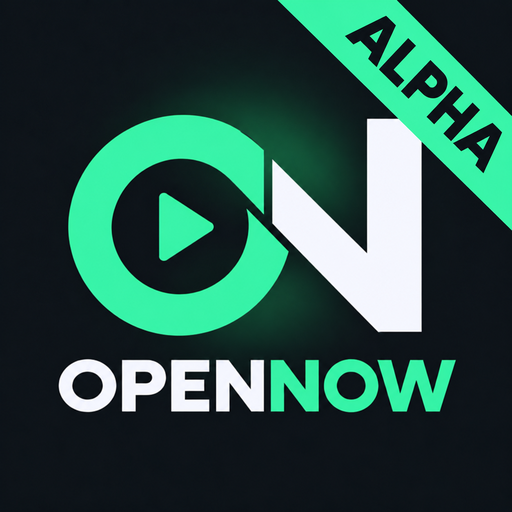
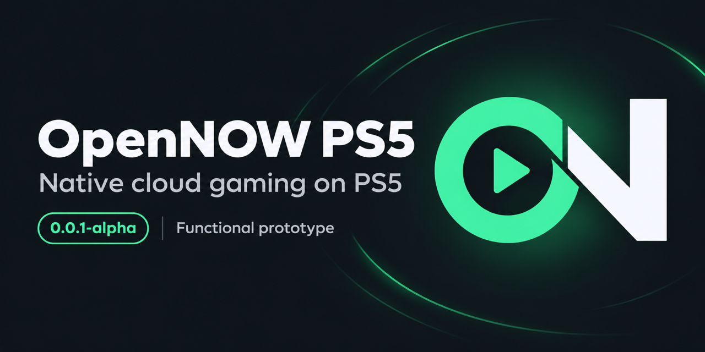

<p align="center">
  
</p>

# OpenNOW PS5



*Social preview artwork for the independent native PS5 prototype.*

An experimental native PS5 homebrew client for GeForce NOW, based on the public [OpenNOW](https://github.com/OpenCloudGaming/OpenNOW) projects. Native hardware video decoding, GPU presentation, stereo audio and DualSense input are integrated.

**This is a working, console-tested prototype, not a finished application.** You can sign in, launch a game and play. The interface is still rough and primarily exists to test that authentication, streaming, audio, video and controls work together. Expect an incomplete user experience, limited navigation and functionality that still needs further testing.

**Latest prerelease: [0.0.5-alpha](https://github.com/Portablelle/opennow-ps5/releases/tag/0.0.5-alpha)** — development build `00.002.035`, title ID `PPSA99082`, with aligned controller icons, a numeric search keypad, explicit HDR/SDR profiles and persistent NVIDIA login. This project is unofficial and unaffiliated with Sony or NVIDIA.

## What works

- NVIDIA device authorization, game/store catalog, session allocation and cancellation.
- Native H.264 and HEVC Main10 decoding, including 10-bit SDR and HDR10 presentation paths.
- Qualified asynchronous Main10 decoding with owned input buffers and safe GPU surface leases.
- Selectable 4K120, 4K90 and 4K60 HDR targets, 4K120/90 SDR targets, and lower-resolution compatibility profiles, with up to 100 Mb/s requested bitrate.
- Full-screen GPU presentation, Opus stereo audio and DualSense controls.

In the latest console test, a 3840 × 2160 Main10 SDR stream was received, decoded and drawn at approximately **92 FPS and 51–52 Mb/s**. No RTP/AU loss, queue overflow, decoder reset or API error was recorded after more than 19 minutes. The tester reported fluid motion and the earlier recurring compression degradation was resolved.

## Prototype limitations

- **The UI is a test interface.** It is not polished, feature-complete or representative of the final experience. Catalog navigation and the controller-driven search keyboard are intentionally basic.
- **Real 120 FPS and HDR game streaming are not yet validated.** The tested game supplied SDR despite an HDR request. Startup fixture tests passed 4K, 119.88 Hz output and HDR scanout; these checks do not establish sustained game FPS or HDR source content.
- The 90 FPS profiles are requests; earlier tests received 60 FPS. Server behavior can differ from the selected target.
- The deeper pipeline currently applies to qualified UHD Main10. H.264 remains at depth one and does not inherit its measured throughput improvement.
- NVIDIA login is saved and renewed automatically. Persistence through a full console reboot and app replacement still needs live validation. NVIDIA can require sign-in again if renewal credentials expire or are revoked. Audio is stereo only; broader firmware/loader compatibility and more games need testing.

Performance may differ by game, server, network, display and profile. Requested settings are targets, not guaranteed results. See [stream quality](docs/STREAM_QUALITY.md) for the measurements.

## Install the alpha

1. Download `OpenNOW-PS5-0.0.5-alpha.zip` and `SHA256SUMS` from [Releases](https://github.com/Portablelle/opennow-ps5/releases).
2. Verify the ZIP against its entry in `SHA256SUMS` using `shasum -a 256` or `sha256sum`. If you download every listed asset, you can use `shasum -a 256 -c SHA256SUMS`.
3. Extract the archive. Install the included `PPSA99082` folder through a compatible native homebrew directory loader, such as ShadowMountPlus. Follow your loader's registration procedure and check that this title ID is unused.
4. Before replacing an existing installation, close OpenNOW completely and retain a backup of its title folder.
5. For the published 0.0.5-alpha package, create `/data/opennow/launch-age.txt` containing your age as an integer from 0 to 120. Development build `00.002.036` instead prompts for your age on the controller before the first launch and saves this private file automatically. It does not supply a default age.
6. Open the app and authenticate using NVIDIA's device authorization page shown on screen. Check that `ACCOUNT SAVED` appears. Circle in the menu closes the app while preserving the saved login; L1+R1 together signs out and removes it.

Requires a PS5 environment that can run native homebrew titles, a GeForce NOW account with suitable streaming capabilities, and a compatible display for the requested mode. The package has been tested in one homebrew console environment; compatibility with other firmware/loader combinations is unverified. This is a directory package, not a retail PS5 store application or a PKG installer.

## Controls

| Control | Action |
| --- | --- |
| Cross | Authenticate or launch the selected game/store |
| D-pad | Select a game/store |
| L1 | Cycle available stream profiles before launch |
| Square | Load the catalog |
| Triangle | Open the catalog search keyboard |
| R1 | Load the next catalog page |
| Circle | Close the app from the menu; cancel text entry in the search keyboard |
| L1+R1 together | Sign out and remove the saved login |
| Options | Edit your saved age from the catalog in development build `00.002.036` |
| Options + touchpad | Stop gameplay streaming; also cancel queueing or retry session cleanup in development build `00.002.036` |

In the search keyboard, use the D-pad to select a character and Cross to type it. Square deletes a character, Triangle clears the text, Options submits the search and Circle cancels. R1 advances through search results; Square in the catalog returns to the full catalog.

In the age dialog, use the D-pad and Cross to enter your own age. Square deletes a digit, Triangle clears the value, Options saves it and Circle cancels without closing the app. When the dialog appears after Play, saving continues that launch. The value stays outside the installed title and is never included in packages.

Development build `00.002.036` preserves a stream failure message after cleanup so you can retry from the catalog. If cleanup fails, use Options + touchpad to retry **STOP SESSION** before starting another game. While the app remains open, it retains the session for another cleanup attempt. Explicitly closing the app attempts cleanup but still exits if the network or credentials prevent it; the remote session may remain active.

For existing installations, artwork files can be cached in the registered title metadata. Use the loader's supported refresh or re-registration procedure if the home-screen icon or background remains stale. Replacing the title folder alone may not refresh the background reference.

## Privacy

NVIDIA login credentials and the device identity are saved in `/data/opennow/account.bin`, outside the installed title, so closing the app, rebooting the PS5 and replacing the app preserve the login. The app restores and renews the saved login automatically; temporary network failures keep the saved credentials and retry. L1+R1 together in the menu signs out and removes the saved login; closing with Circle or stopping a game session keeps it. NVIDIA can still require a new sign-in if the renewal credentials expire or are revoked. The UI reports `ACCOUNT SAVED` or `ACCOUNT NOT SAVED`. The file uses owner-only permissions and contains sensitive credentials without encryption; keep it private.

Public source and packages exclude local configuration, account data, session logs, console dumps and captured gameplay. Private bounded diagnostics can be written under `/data/opennow`; an explicit local marker enables a short video capture for troubleshooting. Do not upload that directory when reporting an issue.

## Build and test

Host tests use synthetic fixtures and do not require a console or account. Install Clang with AddressSanitizer and UndefinedBehaviorSanitizer support, Python 3, and libcurl development headers. This uses the same compiler family as CI:

```sh
CC=clang CXX=clang++ bash tools/test-port.sh
```

To build the development GPU package on a Linux Docker host without the `vps` SSH alias:

```sh
bash tools/gpu/build-local.sh
```

The build downloads and verifies the pinned public SDK archives, builds the GPU runtime and streaming dependencies, and writes `dist/PPSA99082` and `dist/manifest.json`. It does not deploy to a console or include account files. A successful build and host tests do not establish that a live NVIDIA stream works on your console.

To inspect the controller age dialog with the native CPU renderer on Linux or macOS:

```sh
OPENNOW_PREVIEW_AGE=1 bash tools/preview-port.sh
```

The output is `build/preview.png`. Linux needs libcurl development headers and Python Pillow; macOS uses `sips`. This preview uses labeled fixture data, not an authenticated session or video stream.

The alternative SSH build workflow runs Docker on a separate Linux host. Configure the `vps` SSH alias and remote workspace for your environment. That GPU build requires preparing the pinned public GPU SDK/runtime on the remote host; see [native hardware video](docs/NATIVE_HARDWARE_VIDEO.md) and [dependency/source provenance](THIRD_PARTY_NOTICES.md).

```sh
# Software compatibility build
bash tools/build-vps.sh
# GPU build, after preparing .deps/gpu/sdk on the build host
bash tools/build-gpu-vps.sh
```

Generated packages are written to `dist/`. CI checks host behavior; it does not reproduce or validate PS5 hardware execution. No proprietary Sony SDK or firmware module is included.

## Development and licensing

### Credits

**Credit goes to [OpenCloudGaming](https://github.com/OpenCloudGaming), the [OpenNOW](https://github.com/OpenCloudGaming/OpenNOW) authors and contributors, and the [OpenNOW-Switch](https://github.com/OpenCloudGaming/OpenNOW-Switch) contributors.** Their open-source work provides the authentication, streaming protocol and transport foundations that made this native PS5 adaptation possible. This repository is an independent PS5 port prototype, not the official OpenNOW application.

The PS5 platform, decoder and GPU work also builds on public projects including ProsperoLight, the PS5 hardware video research, Kodi PS5, ps5-opengl and the native application boilerplate. Their specific roles, licenses and source revisions are retained in the third-party notices and source headers.

See [port history and measured results](docs/PORT_STATUS.md), [release notes](docs/releases/0.0.5-alpha.md) and [contributing](CONTRIBUTING.md). Other boilerplate documentation covers optional tooling and may describe workflows outside the GPU release path.

The combined native application is **GPL-3.0-or-later**. Third-party components retain their notices in [THIRD_PARTY_NOTICES.md](THIRD_PARTY_NOTICES.md), `licenses/` and source headers. Exact upstream revisions and hashes are recorded in [upstream-lock.json](upstream-lock.json). Public dependency retrieval/build scripts and local GPU modifications are included; no captured game content is distributed.
